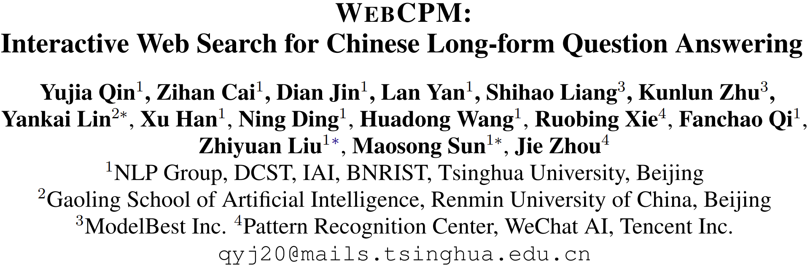
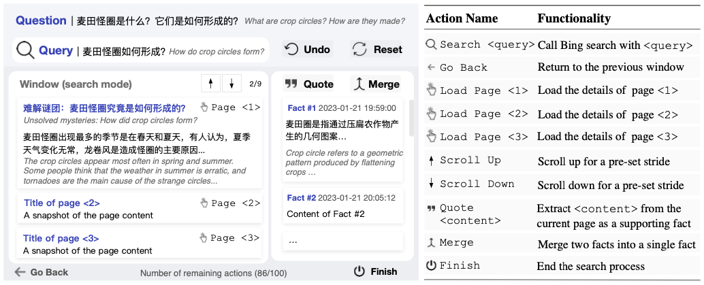
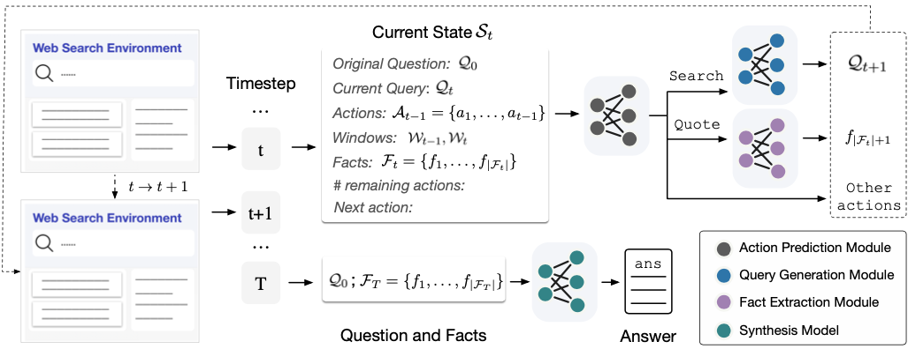
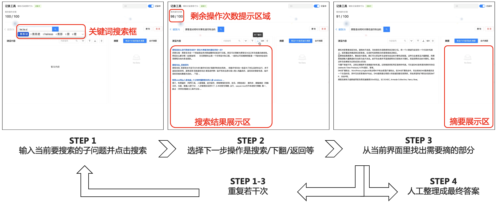

<div align="center">

<h1>WebCPM</h1>

</div>

✨  本项目为下面ACL2023论文的实现：[Interactive Web Search for Chinese Long-form Question Answering](https://arxiv.org/abs/2305.06849)



*Read this in [English](README.md).*

---


## 目录

- [目录](#目录)
- [概述](#概述)
- [需求](#需求)
- [准备](#准备)
  - [准备数据](#准备数据)
  - [准备模型](#准备模型)
- [训练WebCPM](#训练-WebCPM)
  - [流水线式网页搜索简介](#流水线式网页搜索简介)
  - [数据预处理](#数据预处理)
    - [生成互动式网页搜索的训练数据](#生成互动式网页搜索的训练数据)
    - [生成流水线式网页搜索的训练数据](#生成流水线式网页搜索的训练数据)
  - [训练](#训练)
- [单任务评估](#单任务评估)
- [在新问题数据集上运行WebCPM](#在新问题数据集上运行WebCPM)
  - [互动式网页搜索](#互动式网页搜索)
  - [流水线式网页搜索](#流水线式网页搜索)
- [数据标注平台](#数据标注平台)
- [反馈问题或疑问？](#反馈问题或疑问？)
- [工具学习相关链接](#工具学习相关链接)
- [引用](#引用)


## 概述


在这个工作中，我们展示了WebCPM，一个使用中文预训练模型进行互动网页搜索的项目。我们开发了一个网页搜索界面，既可以人工操作，也可以收集人类的网页搜索行为。然后我们使用多达100亿参数的预训练模型进行微调，模仿人类的网页搜索行为，并根据收集到的事实生成答案。我们开源了网页搜索界面，数据集，实现方法，和模型参数。

## 需求

要运行我们的代码，请使用以下命令安装所有依赖包：

```
pip install -r requirements.txt
```

**注意**: 包的不同版本（例如，pytorch）可能导致与论文中的结果不同。但是，无论你使用哪个版本的包，大致结果应该是一致的。

## 准备

### 准备数据

首先从[Google Drive](https://drive.google.com/drive/folders/1IQBOCwhcMUnkxevv9wVFVLIFT3o8f7HX?usp=sharing)下载数据，并将文件`interactive_data`和`pipeline_data`放到./data，或运行以下命令：
下载的文件包含以下内容：

`interactive_data/data.json`是本文实验中使用的数据集（总共5500个实例）。
`interactive_data/data_zhihu.json`是与本文同时收集的额外数据集（约900个实例），问题来源于[知乎](https://www.zhihu.com/people/71-26-1-50)，您可以使用这个数据进行数据增强。
请使用以下代码将上述数据分为训练集、开发集和测试集（设置 --add_zhihu 将添加 data_zhihu.json）。

```bash
cd data
python split.py --add_zhihu
```

除了交互式网页搜索数据外，我们还提供了训练流水线式网页搜索所需的数据集：`pipeline_data`（总共**110k** 个实例）。所有数据均由text-davinci-003创建，然后由人类注释者手动筛选。 （**注意** 这部分内容未包含在论文中，您不需要将其分为训练/开发/测试。）


### 准备模型

WebCPM基于[CPM-bee](https://github.com/OpenBMB/CPM-Live)，有**10B**以上个参数，这是社区中最大的中文预训练语言模型之一。我们使用的是CPM-bee的早期版本，被称为cpm_10b_webcpm_exp.pt。CPM-bee的最新版本将很快开源。**注意，模型检查点尚未针对任何下游任务进行微调**。要访问cpm_10b_webcpm_exp.pt，您可以在[Tsinghua Cloud](https://cloud.tsinghua.edu.cn/d/a02ae00b11434c9c8560/)下载模型参数，或运行以下脚本：
```
cd models
bash download_model.sh
```

上述代码将在`models`中下载10B模型。

## 训练 WebCPM



我们提供了WebCPM的两个版本：（1）交互式网页搜索（ACL论文中提出的方法）和（2）流水线式网页搜索，这种方法更易于部署（该方法未在论文中报告）。两个版本都使用不同的脚本来生成训练数据，并使用相同的代码进行模型训练。

### 流水线式网页搜索简介

该工作流程包括四个阶段：（1）首先，根据原始问题生成可能的搜索查询；（2）然后，对每个搜索查询，调用Bing搜索并访问前K个网页；（3）对于每个网页，提取重要信息；（4）基于所有记录的信息，生成连贯且细致的答案。所有这些任务都通过多任务方式进行训练，请参考`run_web_browsing/run_pipeline.py`。关于交互式网络搜索的详细信息，请参考我们的原始论文。

### 数据预处理

在开始之前，运行以下代码：

```bash
export PYTHONPATH=/**your-base-path**/webcpm
```

以下是生成训练数据的步骤（我们区分交互式网络搜索和流水线式的方法）。以下代码将在相应的文件夹中生成`train_data`，`dev_data`和`test_data`，这些数据将在训练期间被加载。

#### 生成互动式网页搜索的训练数据

首先，使用以下代码为合成模型构造数据：

```bash
cd dataset_interactive
python make_data_synthesis_model.py --data_path ../../data/interactive_data  --augment_qa_data --augment_data_path ../../data/pipeline_data
```

我们解释一下其中的一些参数：

* `data_path`: 源数据路径。
* `augment_qa_data`: 是否使用由text-davinci自动生成的qa数据增加训练数据。（为了复制我们论文中的结果，不要添加此参数）
* `augment_data_path`: 增加训练数据的数据路径。
搜索模型的训练数据生成如下：

```bash
python make_data_search_model.py --add_query --add_action --add_abstract --abstract_all_tokens
```
我们解释一下其中的一些参数：

* `data_path`: 源数据路径。
* `add_query`: 如果为True，将添加查询生成数据。
* `add_abstract`: 如果为True，将添加生成支持事实提取数据。
* `abstract_all_tokens`: 如果为True，支持事实提取模块将生成所有的tokens，而不仅仅是前几个/后几个tokens。
* `add_action`: 如果为True，将添加动作预测数据。
* `add_synthesis`: 如果为True，将为合成模型加载本地数据。注意您必须先运行python make_data_synthesis_model.py以获取合成数据，然后在此处添加此参数。
如果你想以多任务方式训练所有子任务，添加所有上述参数；否则只添加一个参数（例如，`--add_query`）进行单任务测试。

#### 生成流水线式网页搜索的训练数据
请运行以下代码：

```bash
cd dataset_pipeline
python make_data.py
```

### 训练

要训练WebCPM，运行以下代码：

```bash
cd training
export PYTHONPATH=/**your-base-path**/webcpm
export CUDA_VISIBLE_DEVICES=0,1,2,3,4,5,6,7
GPUS_PER_NODE=$(echo $CUDA_VISIBLE_DEVICES | tr ',' '\n' | wc -l | xargs)
echo "Number of visible devices: $GPUS_PER_NODE, should be the same as visible devices"

set -ex

MASTER_ADDR=localhost
MASTER_PORT=3239
NNODES=1
NODE_RANK=0

OPTS=""
OPTS+=" --model-config config/cpm-bee-10b.json"
OPTS+=" --dataset ../data/dataset_interactive/train_data"
OPTS+=" --dataseteval ../data/dataset_interactive/dev_data"
OPTS+=" --epoch 5"
OPTS+=" --batch-size 8"
OPTS+=" --train-iters 100"
OPTS+=" --save-name webcpm_finetuned"
OPTS+=" --max-length 2560"
OPTS+=" --save ../models/"
OPTS+=" --lr 0.0001"
OPTS+=" --inspect-iters 100"
OPTS+=" --warmup-iters 1"
OPTS+=" --save-epochs 1"
OPTS+=" --lr-decay-style noam"
OPTS+=" --weight-decay 0.01"
OPTS+=" --clip-grad 1.0"
OPTS+=" --loss-scale 32768"
OPTS+=" --start-step 0"
OPTS+=" --load ../models/cpm_10b_webcpm_exp.pt"

CMD="torchrun --nnodes=${NNODES} --nproc_per_node=${GPUS_PER_NODE} --rdzv_id=1 --rdzv_backend=c10d --rdzv_endpoint=${MASTER_ADDR}:${MASTER_PORT} finetune_cpm_bee.py ${OPTS}"

echo ${CMD}
$CMD
```

我们解释一下其中的一些参数：

* `dataset` 和 `dataseteval`: 处理后文件的路径。对于交互式网络搜索，它是 dataset_interactive，对于流水线式方法，它是 dataset_pipeline。
* `batch-size`: 单个 GPU 的批大小，真实的批大小将是 #GPUs x 每个 GPU 的批大小。
* `max-length`: 数据的最大序列长度（不是模型），那些更长的训练实例将被丢弃。
* `save-name` 和 `save`:保存微调模型的路径以及保存的模型检查点的名称。
* `epoch`: 训练轮数。
* `load`: 预训练模型检查点的路径（在本例中是 cpmb）。
注意，无论你正在训练哪个模块（或多任务设置），你都可以使用上述代码。我们在 8x80G A100 上进行训练，你可以根据你的 GPU 设备更改批大小，性能对超参数不敏感。

## 单任务评估

为了评估不同的子任务，你可以首先运行以下代码获取你的微调模型在测试数据上的预测：

```bash
cd inference
python inference.py --test_file ../training/dataset_interactive/test.txt --output_file output/test_predictions.json --ckpt_path **your_finetuned_checkpoint.pt
```

我们解释一下其中的一些参数：

* `test_file`: 测试文件的路径，它应在数据预处理过程中生成。
* `output_file`: 你想要写入预测的路径。
* `ckpt_path`: 你的微调模型的路径。
在获得测试文件的预测后，你可以运行以下代码进行单任务评估：

```bash
python evaluate.py --input_file output/test_predictions.txt --evaluate_action
```

我们解释一下其中的一些参数：

* `input_file`: 你写入测试文件预测的路径。
* `evaluate_action`: 你是否想要评估动作预测任务（F1）。
* `evaluate_query`: 你是否想要评估搜索查询生成任务（Rougel-L）。
* `evaluate_abstract`: 你是否想要评估支持事实提取任务（Rougel-L）。
* `abstract_all_tokens`: 你训练模型支持事实提取的模式，如果你生成所有的标记，添加这个参数（Rougel-L）。
* `evaluate_answer`: 你是否想要评估答案合成任务（Rougel-L）。
* `beam_size`: 将 beam size 设置为 1 会显著加速推断，但会稍微损害性能。


## 在新问题数据集上运行WebCPM

这是整个流水线评估的实现。你可以使用以下代码为新问题生成答案。注意这首先需要你从[这里](https://www.microsoft.com/en-us/bing/apis/bing-web-search-api)获取一个必应搜索 API 密钥，并运行以下代码：

```bash
cd run_web_browsing
export PYTHONPATH=/**base-path**/webcpm
export BING_SEARCH_KEY="**Your Bing Search API Key**"
```

### 互动式网页搜索

即将推出。

### 流水线式网页搜索

```bash
python run_pipeline.py --data_path predictions/test.json --ckpt_path **your-checkpoint**
```

我们解释一下其中的一些参数：

* `data_path`: 你写入预测的路径。
* `ckpt_path`: 你使用基于管道的方法训练的检查点的路径。

## 数据标注平台


我们开源了我们的网络搜索界面，你可以用它进行数据注释。请参阅 [Annotation](./annotation_platform/README.md)。目前代码有点混乱，我们将很快上传一个更清晰的版本。


## 反馈问题或疑问？

如果您对该代码或论文有任何疑问，请联系 Yujia (qyj20@mails.tsinghua.edu.cn) 或者开一个 Github issue。

## 工具学习相关链接

鉴于基础模型的强大能力，我们期待看到它们在操纵各种工具中的应用。WebCPM 是一个典型的研究尝试。更多的资源，请参考以下内容：

- **BMTools**. [[Project](https://github.com/OpenBMB/BMTools)]

- **工具学习**. [[Paper](https://arxiv.org/abs/2304.08354)]
  
- **工具学习论文列表**. [[Project](https://github.com/thunlp/ToolLearningPapers)]

## 引用

如果你觉得我们的 WebCPM 有用，请参考以下引用：

```bibtex
@inproceedings{qin2023webcpm,
    title = "Exploring Mode Connectivity for Pre-trained Language Models",
    author={Yujia Qin and Zihan Cai and Dian Jin and Lan Yan and Shihao Liang and Kunlun Zhu and Yankai Lin and Xu Han and Ning Ding and Huadong Wang and Ruobing Xie and Fanchao Qi and Zhiyuan Liu and Maosong Sun and Jie Zhou},
    booktitle = "Proceedings of ACL 2023",
    year = "2023",
    publisher = "Association for Computational Linguistics",
    url = "https://arxiv.org/abs/2305.06849",
}
```
